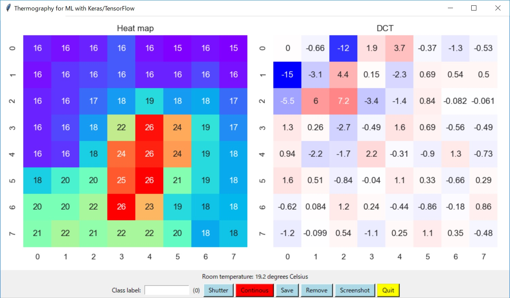

# Thermography


The picture above is me on thermography GUI that I have developed based on matplotlib with Tk.

## Architecture

```  
                 +--------------------------+
                 |      +----------------+  |
                 |      |                |  |
               [R10k] [R10k]             |  |
                 |      |                |  |
                 |      |                |  |
                SCL    SDA               3.3V
           [Infrared sensor]---I2C--->[NUCLEO F401RE]--UART-->[thermography.py/PC]
                GND   3.3V             3.3 GND         
                 |      |                |  |          
                 +      +----------------+  |         
                 +--------------------------+

```

## Infrared array sensor (I2C slave)

- [Infrared array sensor (Panasonic AMG88XX)](https://industrial.panasonic.com/cdbs/www-data/pdf/ADI8000/ADI8000C53.pdf)
- [Data sheet](https://cdn-learn.adafruit.com/assets/assets/000/043/261/original/Grid-EYE_SPECIFICATIONS%28Reference%29.pdf?1498680225)

### Note on AMG88XX

The output data format of AMG88XX is not like a standard image format. On GUI, I made flip twice (verticaly and horizontaly) on the data to convert it into an image format (it is a finder view image, not a mirror image).

## Schematic of my original Arduino shield


- [Arduino shield](./kicad/arduino_board.pdf)

## Implementation

- [I2C adaptor on NUCLEO F401RE with X-CUBE-AI](../AI)
- [Thermography GUI](./thermography)


## Hand gesture recognition: "rock-paper-scissors" with Keras/TensorFlow


### DCT as a feature of hand gesture

Descrete Cosine Transform of 2D image shows some features. I use DCT output as feature for training a neural network.



Note: pixels[0,0] is DC and pixels of higher frequenceis are conisdered as noises, so I apply zigzag scan to the data to extract pixels of lower frequencies (low-pass filtering). Refer to [this page](https://github.com/araobp/stm32-mcu/tree/master/NUCLEO-F401RE/DCT).

### Training a neural network

Class labels:
- rock (1)
- paper (0)
- scissors (2)

Training data: 2D array of 8 x 8 pixels

Data set: [csv files](./thermography/data)

Training result:
- [Model 1: CNN on raw 8x8-pixel images](./tensorflow/rock_paper_scissors_cnn.ipynb)
- [Model 2: DNN on DCT Type-II feature extracted from 8x8-pixel images](./tensorflow/rock_paper_scissors_dct.ipynb)
- [Model 3: DNN on raw 8x8-pixel images](./tensorflow/rock_paper_scissors_raw_data.ipynb)

CNN achived the best score. However, I adopt "model 2" in [my X-CUBE-AI project](https://github.com/araobp/stm32-mcu/tree/master/NUCLEO-F401RE/AI), since the training result is better than "model 3" and the size of neural network (under 1000 parameters) is the smallest among them.

## Interpolation

It is interesting to apply linear interpolation to 8x8 2D images to obtain 32x32 2D image. The image becomes like this:


