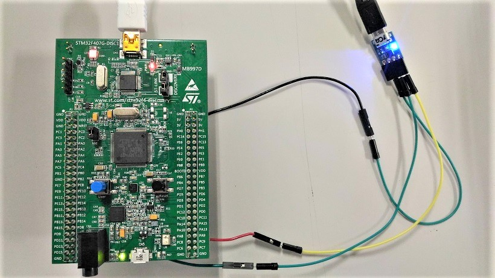
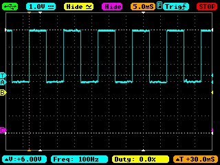

# STMicroelectronics STM32 MCU evaluation

## Motivation

I have been using Microchip PIC MCUs for IoT prototyping over two years. But I have had chances to work with LoRa modules in the past year, and I realized that most of them use [STMicroelectronics](http://www.st.com/content/st_com/en.html)'s STM32 MCUs as a core. It seems to me that STM32 MCUs are becoming a standard platform for IoT devices supporting LPWA or BLE.

It is time to evaluate STM32, comparing with PIC MCUs.

## IDE

I have tried out [Keil uVison](http://www2.keil.com/mdk5/uvision/), [SW4STM32](http://www.openstm32.org/HomePage) and [TrueSTUDIO](https://atollic.com/truestudio/). SW4STM32 and TrueSTUDIO are based on Eclipse with GNU GCC toolchain. The news that STMicro aquired Atollic motivated me to choose TrueSTUDIO.

[STM32 CubeMX Eclipse plugin](http://www.st.com/en/development-tools/stsw-stm32095.html) is also nice: it is like Microchip [MPLAB X MCC plugin](http://www.microchip.com/mplab/mplab-code-configurator).

So I use TrueSTUDIO with Cube MX as IDE for this evaluation.

## Evaluation

I have got these STM32 boards.

### [STM32L476 Nucleo-64](http://www.st.com/en/evaluation-tools/nucleo-l476rg.html)

- [Schematics](http://www.st.com/resource/en/schematic_pack/nucleo_64pins_sch.zip)
- [Datasheet](http://www.st.com/resource/en/datasheet/stm32l476je.pdf)

=> [Eclipse projects](./STM32L476-Nucleo-64)

### [STM32F4 Discovery](http://www.st.com/en/evaluation-tools/stm32f4discovery.html)

- [Schematics](http://www.st.com/resource/en/schematic_pack/stm32f4discovery_sch.zip)
- [Datasheet](http://www.st.com/resource/en/datasheet/dm00037051.pdf)

=> [Eclipse projects](./STM32F4-Discovery)

#### UART and printf

I managed to support printf on USART2.



Physical configuration:

```
STM32F407
               +------------+
            X 5V            |
GND     ----- GND  FTDI     |
PA3(RX) ----- TX  USB-UART  ===== USB ======> PC
PA2(TX) ----- RX  converter |
               +------------+
```

Include the following snippet in main.c to support printf:

```
int _write(int file, char *pbuf, int len)
{
  HAL_UART_Transmit(&huart2, (uint8_t *)pbuf, len, 1000);
  return len;
}
```

#### PWM

PWM output (100Hz, 50% duty) to PA8:



## References

- http://stm32f4-discovery.net/

## Other interests

- [STM32L0 Discovery Kit LPWA](http://www.st.com/en/evaluation-tools/b-l072z-lrwan1.html)
- [AWS FreeRTOS](https://aws.amazon.com/freertos/getting-started/)
- [ESP-IDF](https://esp-idf.readthedocs.io/en/v2.0/index.html)
