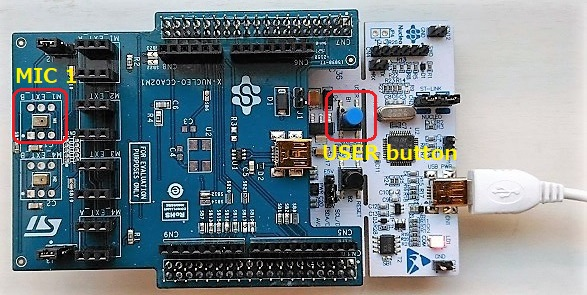
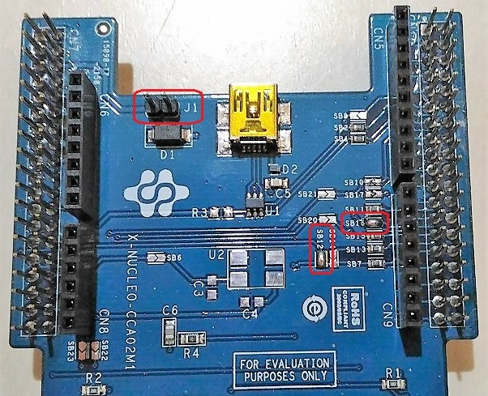
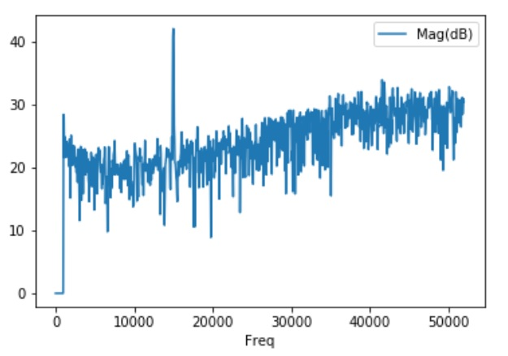

# MEMS Microphones

## DFSDM microphone acquisition

```
                    . . . . . . . . . . . . . . Arm Cortex-M4 . . . . . . . . . . . .
                    .   +-------+                                FFT                .
     +----- Clock ------|       |          +-----+   +-----+   +------+   +------+  .
     |              .   | DFSDM |-- PCM -->| DMA |-->| RAM |-->| Core |-->|USART2|-- UART/USB --> PC
     |              .   |       |          +-----+   +-----+   | DSP  |   +------+  .
     v              .   |       |                              +------+             .
[MEMS mic]--- PDM ----->|       |                                                   .
                    .   +-------+                                                   .
                    . . . . . . . . . . . . . . . . . . . . . . . . . . . . . . . . .
```

## Expansion board

Use [X-NUCLEO-CCA02M1](http://www.st.com/en/ecosystems/x-nucleo-cca02m1.html) expansion board to test MEMS microphones with DFSDM.



## Bridge/jumper setting for one microphone (M1) acquisition



Solder bridges to be closed

|Bridge|Connector|Pin number|STM32L476RG pin|
|------|---------|----------|---------------|
|SB12  |CN7      |35        |PC2            |
|SB16  |CN10     |28        |PA6, PB14      |

Jumper pin setting

|Jumper|Position|Description           |
|------|--------|----------------------|
|J1    |Open    |5V generated on Nucleo|
|J2    |1-2     |Use on-board MIC 1(M1)|

## STM32L476RG pinout configuration (CubeMX)


## Schematics

- [NUCLEO-L476RG schematic](http://www.st.com/resource/en/schematic_pack/nucleo_64pins_sch.zip)
- [X-NUCLEO-CCA02M1 schematic](http://www.st.com/content/ccc/resource/technical/layouts_and_diagrams/schematic_pack/ae/8d/91/e9/14/bc/4f/0e/x-nucleo-cca02m1_schematic.pdf/files/x-nucleo-cca02m1_schematic.pdf/jcr:content/translations/en.x-nucleo-cca02m1_schematic.pdf)

## Code (forked one)

https://github.com/araobp/NUCLEO-L476RG_DFSDM_PDM-Mic

Note: The project above has been converted from SW4STM32 into TrueSTUDIO project, and I have also modified the pinout on CubeMX for the expansion board.

## Test

I used [this on-line tone generator](http://www.szynalski.com/tone-generator/) to generate constant tone at 15000Hz frequency.

Then I confirmed that MEMS mic on the expansion board is working: the pinout configuration and the jumper/SB setting is correct.



The plot is generated by Jupyter Notebook: [Tone_15000Hz.ipynb](./Tone_15000Hz.ipynb).

## References

### Guide

- https://github.com/y2kblog/NUCLEO-L476RG_DFSDM_PDM-Mic
- [Getting started with MEMS microphone expansion board](http://www.st.com/content/ccc/resource/technical/document/user_manual/88/5d/3e/6d/9c/ae/42/de/DM00187403.pdf/files/DM00187403.pdf/jcr:content/translations/en.DM00187403.pdf)
- [STM32L4 DFSDM](http://www.st.com/content/ccc/resource/training/technical/product_training/96/b6/2b/ea/72/3f/4e/d5/STM32L4_System_DFSDM.pdf/files/STM32L4_System_DFSDM.pdf/jcr:content/translations/en.STM32L4_System_DFSDM.pdf)
- [Interfacing PDM digital microphones
 using STM32 32-bit Arm® Cortex® MCUs](http://comm.eefocus.com/media/download/index/id-1014142)

#### Arm Cortex-M DSP extension

- [White Paper - DSP capabilities of Cortex-M4 and Cortex-M7](https://community.arm.com/cfs-file/__key/telligent-evolution-components-attachments/01-2142-00-00-00-00-73-48/ARM-white-paper-_2D00_-DSP-capabilities-of-Cortex_2D00_M4-and-Cortex_2D00_M7.pdf)
- [CMSIS](http://www2.keil.com/mdk5/cmsis/)
- [DSP for Cortex-M](https://developer.arm.com/technologies/dsp/dsp-for-cortex-m)
- [CMSIS Real FFT API documentation](https://www.keil.com/pack/doc/CMSIS/DSP/html/group__RealFFT.html)

### MEMS microphone

- [Top ten MEMS microphone vendors ranked](https://www.edn.com/electronics-blogs/20-20khz/4431541/Top-ten-MEMS-microphone-vendors-ranked)
- [STMicro MP34DT01-M](http://www.st.com/resource/en/datasheet/mp34dt01-m.pdf)
- [Knowles SPH0641LU4H-1](http://www.knowles.com/jpn/content/download/5990/105795/version/1/file/SPH0641LU4H-1.pdf)
