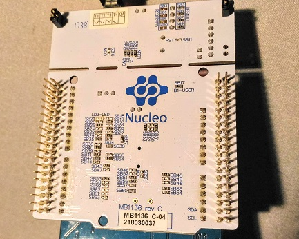

# Turning the Nucelo board into a sound effector

This project is to implementation an effector with the following effects:
- distortion
- compressor
- FIR filter (LPF, HPF and BPF)
- Auto-pan and pseudo-stereo

12bit DAC has dynamic range of 20 * log10(2^12) = 72dB.

## Pipeline

```
MEMS Mic -> DFSDM -> RAM/DMA -> CPU/DSP(effector) -> RAM/DMA -> DAC -> Analog filter (LPF + AC coupling) -> Headphone
```

## DFSDM1 config

- System clock: 80MHz
- Clock divider: 52
- FOSR: 32
- Channel 2 right bit shift: 0
- DMA peripheral-to-memory: circular

## Resolution of PCM output at DFSDM

```
2 * 32^3 = 2^16 (16bit)
```

## DAC1/TMR6 config

- System clock: 80MHz
- TMR6 counter period: 52 * 32 - 1
- DAC1 trigger: TMR6 Trigger Out event
- DMA memory-to-peripheral: circular

## Synchronization between DFSDM1 DMA and DAC1 DMA

- A master clock of both DFSDM1 and DAC1 is the system clock, so cyclic DMA at both DFSDM1 and DAC1 is synchronized with each other.
- Start DFSDM1 DMA just after DAC1 DMA.
- Use double buffer as follows:

```
DFSDM1 DMA            DAC1 DMA
[ A | B ] -- DSP --> [ A | B ]
```

- DSP works on B while DAC1 is reading A, and vice versa.

## Pins on Arduino connector

```
                                     [ ]
                                     [ ]
                                     [ ]
                                     [ ]
  [ ]                                [*] PA5(DAC1 OUT2)
  [ ]                                [ ]
  [ ]                                [ ]
  [ ]                                [ ]
  [ ]                                [ ]
  [*] GND                            [ ]
  [ ]
  [ ]                                [ ]
                                     [ ]
  [ ]                                [ ]
  [ ]                                [ ]
  [*] PA4(DAC1 OUT1)                 [ ]
  [ ]                                [ ]
  [ ]                                [ ]
  [ ]                                [ ]
  ```
## Enabling DAC1 OUT2 for stereo

Unfortunately DAC1 OUT2 is connected to PA5 pin that is also connected to the on-board LCD of Nucleo board. Cut the connection to the LCD by opening SB21: remove zero ohm chip registor from the Nucleo board.



Refer to the schematin on this web site: https://www.st.com/en/evaluation-tools/nucleo-l476rg.html

## UART setting

DMA is used to output data to UART. DMA is MUST: the pipeline processing finishes within the time frame with help from DMA.

Baud rate: 230400bps

## Analog filter


An analog filter is required to attenuate the DAC output voltage, to remove quantization noise and to remove DC offset from DAC output signal.
